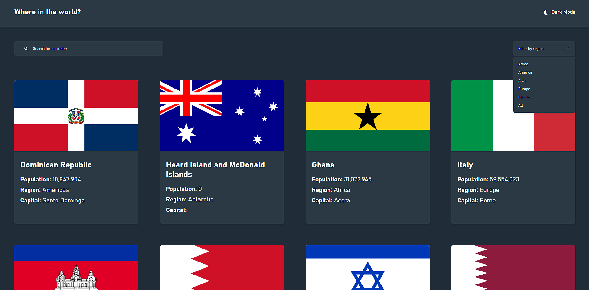

# Advice generator

This is a solution to the [REST Countries API with color theme switcher challenge on Frontend Mentor](https://www.frontendmentor.io/challenges/rest-countries-api-with-color-theme-switcher-5cacc469fec04111f7b848ca).

## :beginner: Overview

[View demo](https://davitjabushanuri.github.io/countries-database/)

## :camera:



## :zap: Usage

Users should be able to:

- See all countries from the [API](https://restcountries.com/) on the homepage
- Search for a country using an input field
- Filter countries by region
- Click on a country to see more detailed information on a separate page
- Click through to the border countries on the detail page
- Toggle the color scheme between light and dark mode

### :notebook: Pre-Requisites

To get a local copy up and running follow these simple example steps.

- [git](https://git-scm.com/)
- [NodeJS](https://nodejs.dev/)
- [npm](https://npmjscom/)

### :electric_plug: Installation

After you've made sure to have all the tools installed, you should be able to just run a few commands to get set up

```
git clone https://github.com/davitJabushanuri/countries-database.git
cd countries-database
npm install
npm start
```

### :hammer: Built With

- [React](reactjs.org)
- [React Router](https://reactrouter.com/)
- [restcountries.com](https://restcountries.com/)
- [Sass](https://sass-lang.com/)
- [Flexbox](https://css-tricks.com/snippets/css/a-guide-to-flexbox/)

## :book: What I learned

### :house: Development

- Add functionality to search countries by currency, language, capital, region and sub region.
- Add a map for each country

### 🤝 Contribution

Your contributions are always welcome and appreciated. Following are the things you can do to contribute to this project.

- **Report a bug**
  If you think you have encountered a bug, feel free to report it [here](https://github.com/davitJabushanuri/countries-database/issues).
  <br/>
- **Request a feature**
  If you have a suggestion that would make this better, You can request for a feature [here](https://github.com/davitJabushanuri/countries-database/issues) with the tag "enhancement".
  <br/>

- **Create a pull request**

  1. Fork the Project
  2. Create your Feature Branch (`git checkout -b feature/AmazingFeature`)
  3. Commit your Changes (`git commit -m 'Add some AmazingFeature'`)
  4. Push to the Branch (`git push origin feature/AmazingFeature`)
  5. Open a Pull Request
     <br/>

> If you are new to open-source, make sure to check read more about it [here](https://www.digitalocean.com/community/tutorial_series/an-introduction-to-open-source) and learn more about creating a pull request [here](https://www.digitalocean.com/community/tutorials/how-to-create-a-pull-request-on-github).

## :star2: Acknowledgment

- [Frontend Masters](https://www.frontendmentor.io/home)
- [React](reactjs.org)

### 📝 License

This project is [MIT](https://github.com/davitJabushanuri/readme/blob/master/LICENSE) licensed.
